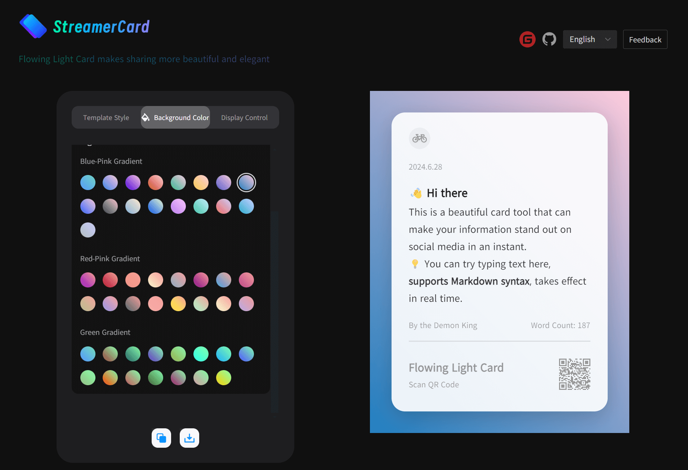
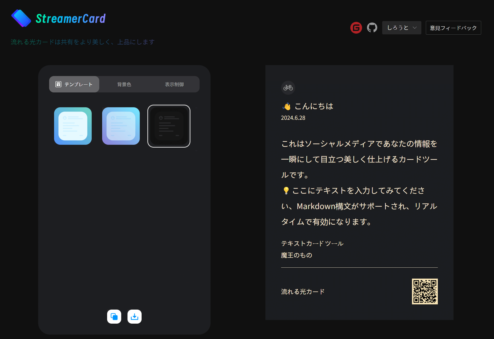

<div align="center">
<a href="https://fastgpt.in/"></a>
</div>

<h2 align="center">流光卡片 API</h2>

通过流光卡片 API 你可以通过使用将精美卡片生成对接到您的程序，或者业务流中，例如批量生成精美卡片营销内容等等

<p align="center">
  <a href="./README_en.md">English</a> |
  <a href="./README.md">简体中文</a>
</p>

## 1、🛸 在线使用

- 海外版：https://www.streamertextcard.com/en
- 国内版：https://fireflycard.shushiai.com/zh
- 使用流光卡片制作的卡片案例：https://ew6rccvpnmz.feishu.cn/wiki/OHZFwIREFiNrzZkQ0s8c2G54nee?fromScene=spaceOverview

|  |  |
| ------------------------------------------------------------ | ------------------------------------------------------------ |
|  |  |


## 2、API 实现原理

项目技术栈：NodeJs + Express + Puppeteer

话说回来，Express 和 puppeteer 又是什么东西？

- Express：用于创建Web服务器和处理HTTP请求
- Puppeteer：用于控制无头浏览器（如Chrome）进行网页的自动化操作。**（重点是这个技术栈）**

一句话说明，这个 API 的原理就是通过类似爬虫，自动化的库，打开 Puppeteer 然后修改卡片上的文本，图像等信息，最后对卡片进行截图，响应给前端，你也可以通过其他相似的技术栈来实现这个功能，比如：

- Python + Flask/Django + Selenium/Playwright
- Java + Spring Boot + Selenium
- .....

总之你可以使用你喜欢的语言重写这个 API 也是完全没问题的，毕竟原理就是如此简单，**找一个库，可以打开浏览器，然后截图指定元素，最后响应前端。**

不过在本开源项目中还针对并发场景做了一些优化，比如增加了重试机制，引入了 puppeteer-cluster 来管理浏览器实例


## 3、常见问题

#### 3.1、部署 Linux 生成图片中文乱码

原因是因为一般 Linux 默认字体不支持中文，需要自己安装中文字体，比如你是 centOS，你可以尝试执行以下命令解决：

```sh
sudo yum install wqy-microhei-fonts.noarch -y
sudo yum install wqy-unibit-fonts.noarch -y
sudo yum install wqy-zenhei-fonts.noarch -y
```

或者自己上网搜一下中文字体即可


#### 3.2 表情包乱码

```
sudo apt-get install fonts-noto-color-emoji
```


## 4、👨‍💻如何部署

**注意：node版本必须大于18**

### 手动安装环境部署 linux

保姆级教程：Linux (Ubuntu) 部署流光卡片开源 API：https://blog.csdn.net/weixin_46184095/article/details/140297726

### Docker执行

#### docker cli

#### 编译

```bash
docker build -t ygh3279799773/streamer-card:latest .
```

#### 运行

```bash
docker run -d --name streamer-card -p 3003:3003 --restart always ygh3279799773/streamer-card:latest
```

#### 停止

```bash
docker stop streamer-card
```

##### 使用方式

```bash
# 安装依赖：
yarn install

#运行示例：
ts-node src/index.ts
or
node src/index.js
```


## 5、接口说明 POST 

本地部署请求地址：http://localhost:3003/api/saveImg

线上公开请求地址：http://fireflycard-api.302ai.cn/api/saveImg

### 快速入门

在网页 https://fireflycard.shushiai.com/ 上编辑好卡片，点击复制 json 粘贴作为 body 参数，如下：


### 具体参数说明

一些参数说明可能不太全面，有什么问题随时跟我说

| 字段名           | 类型       | 描述                                                         |
| ---------------- | ---------- | ------------------------------------------------------------ |
| `temp`           | String     | 模板别名，**往下看参数说明**                                 |
| `color`          | String     | 颜色别名，也可以直接上传图片 url 实现自定义背景图片，**往下看参数说明** |
| `hasRandomColor` | Boolean    | 随机颜色，如果传递了 `color` 这个参数不会生效                |
| `icon`           | String     | 头像链接                                                     |
| `title`          | String     | 标题                                                         |
| `date`           | String     | 时间显示，不传递默认展示当前时间                             |
| `content`        | String     | 卡片正文                                                     |
| `foreword`       | String     | 前言                                                         |
| `author`         | String     | 作者                                                         |
| `qrcodetitle`    | String     | 二维码头部                                                   |
| `qrcodetext`     | String     | 二维码描述文字                                               |
| `qrcode`         | String     | 你的二维码链接                                               |
| `qrcodeImg`      | String     | 你的二维码图片（优先级比`qrcode`高，选其一即可）             |
| `watermark`      | String     | 水印                                                         |
| `switchConfig`   | **Object** | 展示控制，**往下看参数说明**                                 |
| `width`          | String     | 宽度，最小 300                                               |
| `height`         | String     | 高度                                                         |
| `padding`        | String     | 内边距                                                       |
| `fontScale`      | String     | 文字大小比例（例如传入1.2或者1.4等）                         |
| `useFont`        | String     | 字体类型，**往下看参数说明**                                 |
| `imgScale`       | String     | 图片清晰度，默认为 2，数值越大越清晰，同时下载时间也更长     |
| `textCount`      | number     | 计数描述                                                     |
| `align`          | String     | 对齐方式：left、align、right、justify（两端对齐）            |
| `signature`      | String     | 个性签名                                                     |
| `textColor`      | String     | 文本颜色，例如：#FFFFFF                                      |
| `fonts`          | **Object** | 调整字体大小，**往下看参数说明**                             |

### switchConfig 参数说明

| 字段名          | 类型    | 描述     |
| --------------- | ------- | -------- |
| `showIcon`      | Boolean | 图标显示 |
| `showDate`      | Boolean | 日期显示 |
| `showTitle`     | Boolean | 标题显示 |
| `showContent`   | Boolean | 文本显示 |
| `showAuthor`    | Boolean | 作者显示 |
| `showTextCount` | Boolean | 计数描述 |
| `showQRCode`    | Boolean | 二维码   |
| `showForeword`  | Boolean | 前言     |

### fonts 参数说明

这个参数只有金句模板会用到，其他模板不会生效

| 字段名    | 类型   | 描述     |
| --------- | ------ | -------- |
| title     | number | 标题倍数 |
| content   | number | 标题倍数 |
| translate | number | 标题倍数 |
| author    | number | 标题倍数 |

例如：

```json
{
    "title": 2.1329337874720125,
    "content": 1.9079435748084854,
    "translate": 1.1415042034904328,
    "author": 0.801229782035275

```

### useFont 参数说明

打开网页 https://fireflycard.shushiai.com/，选择好字体类型，复制 json 查看内容找到 useFont 属性，就能看到字体参数名称

**注意：**暂不支持自定义字体

### temp 参数说明

打开网页 https://fireflycard.shushiai.com/，鼠标移动到模板上会弹出别名，就是这个


### color参数说明

打开网页 https://fireflycard.shushiai.com/，然后在右侧菜单栏就能看到颜色别名

也可以直接输入图片 url 实现自定义背景图片


### 请求示例

本地部署请求地址：http://localhost:3003/api/saveImg

线上公开请求地址：http://fireflycard-api.302ai.cn/api/saveImg

```json
{
  "title": "<h4><span style=\"background-color: transparent; font-size: 61.4285px;\">一句封神</span><br></h4><div><p>名著金句</p></div>",
  "translate": "<p>| 生存还是毁灭，这是个问题</p>",
  "author": "是魔王哒",
  "font": "SourceHanSerifCN_Bold",
  "align": "left",
  "width": 400,
  "height": 533,
  "fontScale": 1.2,
  "ratio": "3:4",
  "padding": 30,
  "switchConfig": {
    "showIcon": false,
    "showTitle": true,
    "showContent": false,
    "showTranslation": true,
    "showAuthor": true,
    "showQRCode": false,
    "showSignature": true,
    "showQuotes": true
  },
  "temp": "tempJin",
  "fonts": {
    "title": 2.1329337874720125,
    "content": 1.9079435748084854,
    "translate": 1.1415042034904328,
    "author": 0.801229782035275
  },
  "signature": "打工人，吃吃喝喝睡饱饱",
  "textColor": "rgba(0,0,0,0.8)",
  "subTempId": "tempJin",
  "borderRadius": 15,
  "color": "bg-color-11",
  "useFont": "SourceHanSerifCN_Bold",
  "useLoadingFont": true
}
```


### 响应示例

> 会直接响应二进制图片，使用 ApiPost 可以直接预览相应图片


## 6、如果你对我们感兴趣

推特：@huangzh65903362

即刻：https://web.okjike.com/u/ec41d7d5-407d-4395-ac8a-bd0f04fb202c

小红书：https://www.xiaohongshu.com/user/profile/6220bf22000000001000e083


